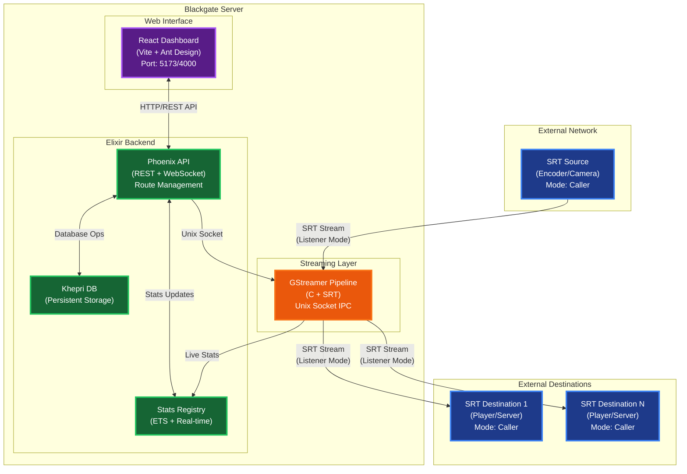
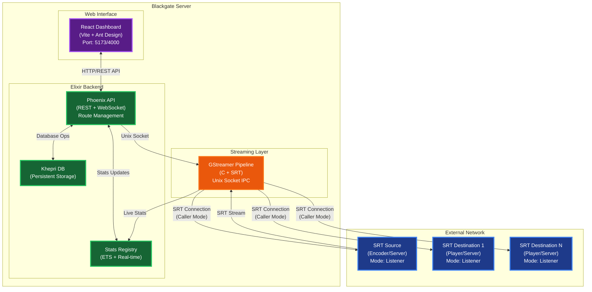

# Blackgate Server - Product Knowledge

## 1. Executive Summary
**Blackgate Server** is a high-performance, containerized Secure Reliable Transport (SRT) gateway designed for professional live video broadcasting. It acts as the central nervous system for live video production, securely receiving video feeds from remote locations (cameras, OBS, live-backpacks) and seamlessly routing them to destinations (broadcasting studios, cloud ingest points, or multi-streaming platforms). 

Built on a robust Elixir backend and deployed as a lightweight Linux appliance, Blackgate ensures ultra-low latency, packet loss recovery, and AES-256 encryption over unpredictable public internet connections.

---

## 2. Core Value Proposition
Traditional live broadcasting relies on expensive satellite trucks (DSNG) or dedicated fiber optic lines. Standard internet protocols (like UDP or RTMP) suffer from stuttering, packet loss, and high latency when streaming over standard 4G/5G or home broadband.

**Blackgate solves this by leveraging the SRT protocol:**
*   **Packet Recovery:** It mathematically reconstructs lost video frames before they reach the viewer, resulting in television-grade reliability over terrible internet connections.
*   **Ultra-Low Latency:** Optimized for sub-second delay, making it perfect for live two-way interviews.
*   **Secure by Default:** Features AES-128/256 video encryption to prevent stream interception.
*   **Centralized Management:** Gives network engineers a single, beautiful "air traffic control" dashboard to monitor and route every camera feed in their organization.
*   **Zero-overhead Transport:** Uses native C bindings and GStreamer's `tsparse` to demux and remux streams without the CPU overhead of transcoding.
*   **Embedded Fault-Tolerant DB:** Uses Khepri (Raft consensus) right inside the BEAM VM for storing route configuration, removing the need for an external SQL database.

---

## 3. Recent Feature Additions (Latest First)

### UI/UX Quick Wins
- **Bulk Start/Stop**: Manage multiple routes simultaneously using table checkboxes and a single click.
- **Route Cloning**: Instantly duplicate complex route configurations including all their multi-destinations.
- **Filter Persistence**: Search and filter settings (status, schema, text) remember their state across page navigation.
- **Dual Save Buttons**: "Save and Continue" vs "Save and Exit" when editing routes.

### Seamless Auto-Restart
Editing a running route's configuration (or its destinations) seamlessly restarts the native pipeline in the background applying the new config without requiring manual stop/start clicks. 

### Machine Locking & Anti-Tampering (Planned)
Future license enforcement will integrate dmidecode (UUID, Serial, MAC) to lock licenses to specific baremetal hardware.

### Baremetal ISO Installer (Planned)
Future distribution method packaging Debian Bookworm + Blackgate + Docker into a self-installing ISO using Preseed, allowing customers to install the entire appliance from a USB drive in 5 minutes.

---

## 4. Key Features

### Dynamic Stream Routing
Easily ingest a single SRT feed (e.g., a cameraman in the field) and dynamically route that exact feed to multiple destinations simultaneously (e.g., YouTube, Twitch, and a local production studio) without putting extra bandwidth strain on the cameraman.

### Real-Time Telemetry & Monitoring
Stop guessing why a stream is lagging. The Blackgate dashboard provides live, granular metrics:
*   Incoming and Outgoing Bitrate graphs.
*   Round-Trip Time (RTT) latency tracking.
*   Packet Loss percentage visualization.

### Built-in Video Preview
Verify your feeds before they go to air. Blackgate decodes the incoming SRT stream and displays a live video and audio visualizer preview directly inside your web browser.

### Enterprise Access & Licensing
*   Encrypted database utilizing a distributed Raft consensus algorithm (Khepri).
*   Configurable admin user management.
*   Hardware-bound offline RSA-cryptographic license verification to ensure secure software distribution.

---

## 5. Target Audience & Use Cases
Blackgate is engineered for professionals who cannot afford a stream to go offline:
*   **Live Event Production & Esports:** Routing dozens of player cameras and commentator feeds to a central mixing studio.
*   **News Organizations (ENG):** Receiving live hit feeds from journalists reporting via 5G backpacks.
*   **Corporate Webcasting:** Securely transmitting town halls and CEO addresses between global offices.
*   **Church Broadcasting:** Linking multi-campus services together in real-time.
*   **Cloud Video Infrastructure:** Cloud video infrastructure providers needing an edge ingest gateway.

---

## 6. Technical Specifications

| Feature | Specification |
| :--- | :--- |
| **Protocol** | SRT (Secure Reliable Transport) |
| **Connection Modes** | Caller, Listener, Rendezvous |
| **Video Support** | Agnostic (H.264, HEVC, MPEG-2, AV1) |
| **Audio Support** | Agnostic (AAC, Opus, Uncompressed) |
| **Encryption** | Optional AES-128, AES-192, AES-256 |
| **Architecture** | Elixir (Erlang VM) + React Frontend |
| **Deployment** | Baremetal / Proxmox / VMware VM Appliance (.iso) |

---

## 7. Deployment Architecture
Blackgate is deliberately designed as a **stateless, immutable appliance**. 
It is distributed as a custom Ubuntu Linux `.iso` image. Upon booting in a virtual machine wrapper like Proxmox or VMware ESXi, standard Linux bootloaders seamlessly extract the core Blackgate Docker environment into system RAM, executing the application without the need for manual Linux configuration or dependencies.

### System Topology

### SRT Caller Source Workflow

---

## 8. System Hardware Requirements
Blackgate is designed to be highly efficient, running both the Elixir backend and the actual video routing engine on minimal hardware footprints.

| Component | Minimum Specification | Recommended Specification (5+ Streams) |
| :--- | :--- | :--- |
| **CPU** | 2-Core Intel/AMD x86_64 | 4-Core Intel/AMD x86_64 |
| **RAM** | 4GB DDR4 | 8GB DDR4 |
| **Storage** | 16GB SSD (Appliance Boot) | 32GB NVMe SSD |
| **Network** | 1Gbps Ethernet Interface | 10Gbps Ethernet Interface |

---

## 9. Security & Compliance
We understand that corporate and broadcast streams contain highly sensitive, embargoed information. Blackgate guarantees complete data safety from end-to-end:

*   **No Cloud Dependency:** Blackgate does not require a connection to our servers to function. Your streams never leave your infrastructure unless you route them out.
*   **SRT AES Encryption:** Support for military-grade AES-128, AES-192, or AES-256 encryption on all incoming and outgoing SRT streams.
*   **Encrypted Storage:** All system settings, credentials, and routing rules are saved to disk using an encrypted `Khepri` key-value store. 
*   **Zero Telemetry:** The appliance does not phone home with user data, stream analytics, or network layouts.

---

## 10. Next Steps / Conclusion
Blackgate Server represents the modern approach to IP video transmission. By replacing fragile UDP flows and expensive satellite uplinks with a secure, dashboard-driven SRT node, engineering teams can guarantee reliable video transport from anywhere in the world.

Whether deployed as a dedicated hardware server in a broadcast master control room, or spun up dynamically in AWS to handle sudden esports tournament demands, Blackgate scales with your production.
