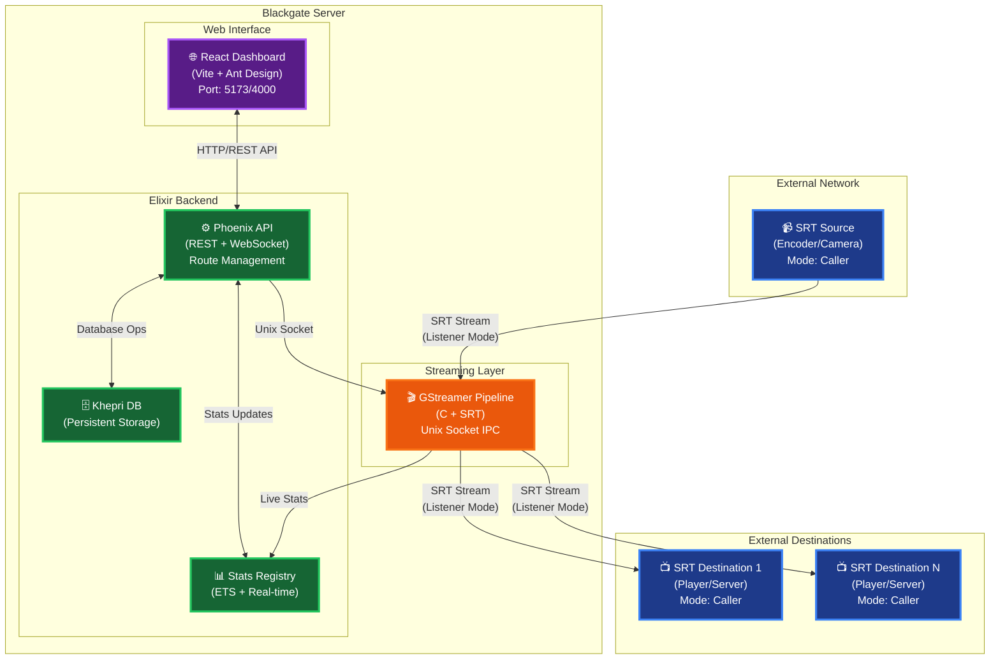
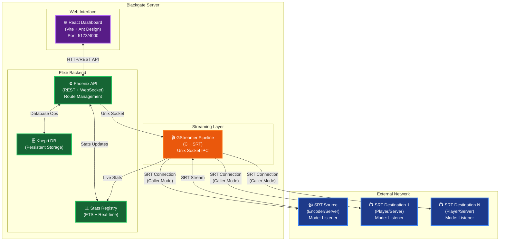

<p align="center">
  
</p>

<p align="center">
  <strong>🎬 Open-source SRT Video Gateway</strong><br>
  <em>High-performance video routing with secure, reliable transport</em>
</p>

<p align="center">
  <a href="#-features">Features</a> •
  <a href="#-quick-start">Quick Start</a> •
  <a href="#-architecture">Architecture</a> •
  <a href="#-docker">Docker</a> •
  <a href="#-api">API</a>
</p>

<p align="center">
  
  
  
  
  
</p>

---

> 🚀 **Alpha**: Core features functional. Actively improving based on real-world usage.

## ✨ Features

### Core Capabilities

| Category | Features |
|----------|----------|
| **🔌 SRT Transport** | Listener, Caller, Rendezvous modes with passphrase authentication |
| **📡 UDP Support** | Source and Destination for local network streaming |
| **📊 Live Source Statistics** | Real-time bitrate, RTT, packet loss, bandwidth, connected callers |
| **📈 Destination Statistics** | Per-destination stats with connected client details (IP, bitrate, RTT) |
| **🖥️ Dashboard** | System metrics (CPU, RAM, Load) with auto-refresh |
| **🛣️ Route Management** | Create, edit, start, stop, delete routes with multiple destinations |
| **🔧 REST API** | Full programmatic control for automation |
| **🐳 Docker Ready** | One-command deployment with backup/restore |
| **⚡ High Bitrate** | Supports 50Mbps+ streams with optimized passthrough pipeline |

### 📈 Real-time Statistics

#### Source Statistics
Monitor your input streams with live metrics:
- **Bitrate** - Current receiving rate (Mbps)
- **RTT** - Round-trip time for connection quality
- **Packet Loss** - Percentage of lost packets
- **Bandwidth** - Available connection bandwidth
- **Connected Callers** - Active source connections (listener mode)

#### Destination Statistics
Track each SRT output destination:
- **Send Rate** - Current bitrate per destination
- **RTT** - Round-trip time to destination
- **Bytes Sent** - Total data transmitted
- **Connected Clients** - Clients pulling streams (listener mode)
- **Per-client details** - IP address, bitrate, RTT, packets sent

### 🚧 Roadmap

- [x] ~~SRT Destination Statistics~~ ✅
- [ ] Cluster Mode for high availability
- [ ] Dynamic Routing rules
- [ ] RTSP / RTMP / HLS / WebRTC support
- [ ] Stream health monitoring & alerts

---

## 🏗️ Architecture

### 🌐 Network Topology

#### 📥 SRT Listener Source Workflow



#### 📤 SRT Caller Source Workflow



### 🛠️ Technology Stack

| Component | Technology | Purpose |
|-----------|------------|---------|
| **Frontend** | React 18 + Vite + Ant Design | Real-time dashboard & route management |
| **Backend** | Elixir / Phoenix | REST API, WebSocket, route orchestration |
| **Database** | Khepri (Raft consensus) | Persistent configuration storage |
| **Stats** | ETS + Registry | In-memory real-time statistics |
| **Streaming** | C + GStreamer | High-performance video processing |
| **Transport** | Haivision SRT | Secure, reliable UDP-based streaming |
| **IPC** | Unix Socket | Low-latency backend ↔ pipeline communication |

---

## 🚀 Quick Start

### Prerequisites

<details>
<summary><strong>Ubuntu/Debian</strong></summary>

```bash
sudo apt-get update
sudo apt-get install libgstreamer1.0-dev libgstreamer-plugins-base1.0-dev \
  gstreamer1.0-plugins-good gstreamer1.0-plugins-bad \
  libcjson-dev libsrt-dev libcmocka-dev libglib2.0-dev pkg-config build-essential
```
</details>

<details>
<summary><strong>macOS</strong></summary>

```bash
brew install gstreamer gst-plugins-base gst-plugins-good gst-plugins-bad \
  cjson srt cmocka pkg-config
```
</details>

<details>
<summary><strong>Windows (WSL2)</strong></summary>

WSL2 is fully supported. Use Ubuntu/Debian instructions inside WSL:

```bash
# Install WSL2 with Ubuntu (run in PowerShell as Admin)
wsl --install -d Ubuntu

# Then inside WSL, install dependencies
sudo apt-get update
sudo apt-get install libgstreamer1.0-dev libgstreamer-plugins-base1.0-dev \
  gstreamer1.0-plugins-good gstreamer1.0-plugins-bad \
  libcjson-dev libsrt-dev libcmocka-dev libglib2.0-dev pkg-config build-essential
```

**Tips:**
- Use **WSL2** (not WSL1) for better performance
- Store project in WSL filesystem (`~/projects/`) not Windows (`/mnt/c/`)
- Use Docker Desktop with WSL2 backend for production
</details>

<details>
<summary><strong>Windows (Native) ⚠️</strong></summary>

> ⚠️ **Not officially supported.** Native Windows requires manual compilation of GStreamer and SRT libraries which is complex. We recommend using **WSL2** or **Docker Desktop** instead.

If you must run natively:
1. Install [MSYS2](https://www.msys2.org/)
2. Build GStreamer from source with SRT support
3. Build the native C pipeline with MinGW

For production on Windows, use **Docker Desktop** which handles all dependencies.
</details>

**Also requires:** Elixir 1.17+, Erlang/OTP 27+, Node.js 18+

### Development

```bash
# Clone the repository
git clone https://github.com/visual-alchemy/blackgate-project.git
cd blackgate-project

# Install dependencies
mix deps.get
cd web_app && yarn install && cd ..

# Start development servers
make dev-all
```

🌐 **Access:** http://localhost:5173  
🔐 **Login:** `admin` / `password123`

---

## 🐳 Docker

```bash
# Build and run
docker-compose build
docker-compose up -d
```

🌐 **Access:** http://localhost:4000

---

## 🚢 Production Deployment

### Option 1: Docker (Recommended)

```bash
# Build production image
docker-compose build

# Start in background
docker compose up -d

# View logs
docker compose logs -f

# Stop
docker compose down
```

### Option 2: Elixir Release

```bash
# Build frontend for production
cd web_app && npm run build && cd ..

# Build native pipeline
cd native && make clean && make && cd ..

# Create Elixir release
MIX_ENV=prod mix release

# Run the release
_build/prod/rel/blackgate/bin/blackgate start
```

### Commands Reference

| Command | Purpose |
|---------|---------|
| `make dev-all` | Development (hot-reload, debug) |
| `docker compose up -d` | Production (Docker) |
| `docker compose logs -f` | View production logs |
| `MIX_ENV=prod mix release` | Build production release |

---

## 🔌 API

### Routes

| Method | Endpoint | Description |
|--------|----------|-------------|
| `GET` | `/api/routes` | List all routes |
| `POST` | `/api/routes` | Create a route |
| `GET` | `/api/routes/:id` | Get route details |
| `PUT` | `/api/routes/:id` | Update a route |
| `DELETE` | `/api/routes/:id` | Delete a route |
| `GET` | `/api/routes/:id/start` | Start a route |
| `GET` | `/api/routes/:id/stop` | Stop a route |
| `GET` | `/api/routes/:id/stats` | Get source statistics |
| `GET` | `/api/routes/:id/destination-stats` | Get destination statistics |

### Destinations

| Method | Endpoint | Description |
|--------|----------|-------------|
| `GET` | `/api/routes/:id/destinations` | List destinations |
| `POST` | `/api/routes/:id/destinations` | Add destination |
| `PUT` | `/api/routes/:id/destinations/:dest_id` | Update destination |
| `DELETE` | `/api/routes/:id/destinations/:dest_id` | Remove destination |

---

## ⚙️ Environment Variables

| Variable | Description | Default |
|----------|-------------|---------|
| `API_AUTH_USERNAME` | Auth username | *(required)* |
| `API_AUTH_PASSWORD` | Auth password | *(required)* |
| `PORT` | API port | `4000` |
| `DATABASE_DATA_DIR` | Database path | `./khepri` |

---

## 📄 License

MIT License - feel free to use in personal and commercial projects.

---

<p align="center">
  Made with ❤️ by <a href="https://github.com/visual-alchemy">Visual Alchemy</a>
</p>
