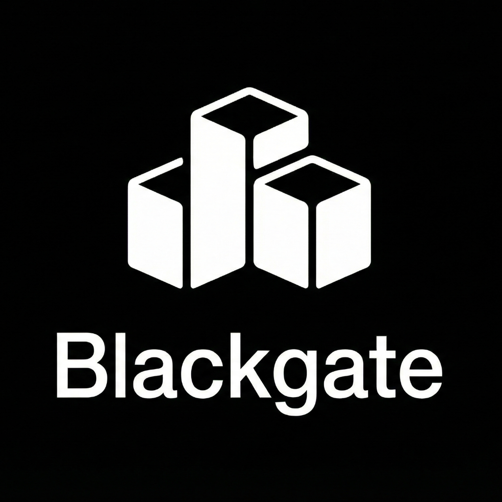
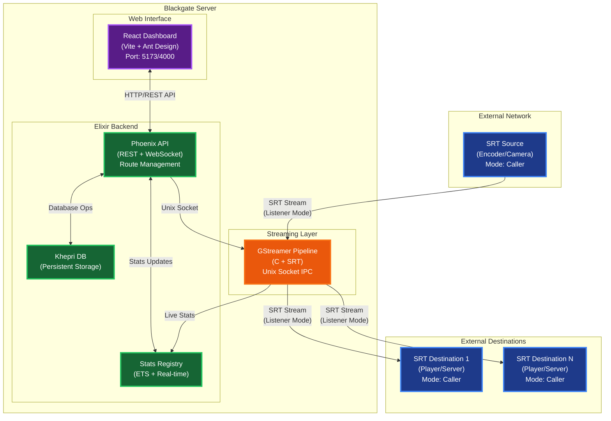
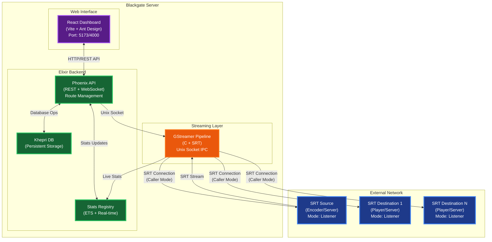

# Blackgate — SRT Video Gateway



**High-performance video routing with secure, reliable transport**

> **Alpha**: Core features functional. Actively improving based on real-world usage.

---

## Features

### Core Capabilities

| Category | Features |
|----------|----------|
| **SRT Transport** | Listener, Caller, Rendezvous modes with passphrase authentication |
| **UDP Support** | Source and Destination for local network streaming |
| **Live Source Statistics** | Real-time bitrate, RTT, packet loss, bandwidth, connected callers |
| **Destination Statistics** | Per-destination stats with connected client details (IP, bitrate, RTT) |
| **Connection Status** | Live indicator on the Routes table showing real-time SRT connection health |
| **Dashboard** | System metrics (CPU, RAM, SWAP, Load) with auto-refresh and live video preview |
| **Route Management** | Create, edit, clone, start, stop, delete routes with multiple destinations |
| **Auto-Restart** | Editing a running route automatically restarts the pipeline — no manual stop/start needed |
| **Bulk Operations** | Select and start/stop multiple routes at once |
| **Search & Filter** | Filter routes by name, status, or schema type |
| **Credential Management** | Change admin username and password from the Settings UI |
| **REST API** | Full programmatic control for automation |
| **Docker Ready** | One-command deployment with backup/restore |
| **High Bitrate** | Supports 50Mbps+ streams with optimized passthrough pipeline |

### Real-time Statistics

#### Source Statistics
Monitor your input streams with live metrics:
- **Bitrate** — Current receiving rate (Mbps)
- **RTT** — Round-trip time for connection quality
- **Packet Loss** — Percentage of lost packets
- **Bandwidth** — Available connection bandwidth
- **Resolution** — Detected video resolution (e.g. 1920×1080, 3840×2160)
- **Framerate** — Exact or inferred FPS with scan type (progressive/interlaced)
- **Connected Callers** — Active source connections (listener mode)

#### Destination Statistics
Track each SRT output destination:
- **Send Rate** — Current bitrate per destination
- **RTT** — Round-trip time to destination
- **Bytes Sent** — Total data transmitted
- **Connected Clients** — Clients pulling streams (listener mode)
- **Per-client details** — IP address, bitrate, RTT, packets sent

#### Connection Status Indicator
The Routes table shows a live connection status badge for each route:
- **Connected** — Stream is actively transmitting/receiving
- **Waiting** — Process is running but no active SRT connection
- **Off** — Route process is stopped

### Roadmap

- [x] ~~SRT Destination Statistics~~
- [x] ~~Real-time Connection Status~~
- [x] ~~Bulk Route Operations~~
- [x] ~~Route Cloning~~
- [x] ~~Credential Management~~
- [ ] Cluster Mode for high availability
- [ ] Dynamic Routing rules
- [ ] RTSP / RTMP / HLS / WebRTC support
- [ ] Stream health monitoring & alerts

See [ROADMAP](./ROADMAP.md) for the full roadmap.

---

## Architecture

### Network Topology

#### SRT Listener Source Workflow


```mermaid
graph TB
    subgraph "External Network"
        A["SRT Source<br/>(Encoder/Camera)<br/>Mode: Caller"]
    end
    
    subgraph "Blackgate Server"
        subgraph "Web Interface"
            B["React Dashboard<br/>(Vite + Ant Design)<br/>Port: 5173/4000"]
        end
        
        subgraph "Elixir Backend"
            C["Phoenix API<br/>(REST + WebSocket)<br/>Route Management"]
            D["Stats Registry<br/>(ETS + Real-time)"]
            E["Khepri DB<br/>(Persistent Storage)"]
        end
        
        subgraph "Streaming Layer"
            F["GStreamer Pipeline<br/>(C + SRT)<br/>Unix Socket IPC"]
        end
    end
    
    subgraph "External Destinations"
        G["SRT Destination 1<br/>(Player/Server)<br/>Mode: Caller"]
        H["SRT Destination N<br/>(Player/Server)<br/>Mode: Caller"]
    end
    
    A -->|"SRT Stream<br/>(Listener Mode)"| F
    F -->|"SRT Stream<br/>(Listener Mode)"| G
    F -->|"SRT Stream<br/>(Listener Mode)"| H
    
    B <-->|"HTTP/REST API"| C
    C <-->|"Database Ops"| E
    C <-->|"Stats Updates"| D
    C -->|"Unix Socket"| F
    F -->|"Live Stats"| D
    
    classDef external fill:#1e3a8a,stroke:#3b82f6,stroke-width:3px,color:#ffffff
    classDef ui fill:#581c87,stroke:#a855f7,stroke-width:3px,color:#ffffff
    classDef backend fill:#166534,stroke:#22c55e,stroke-width:3px,color:#ffffff
    classDef streaming fill:#ea580c,stroke:#f97316,stroke-width:3px,color:#ffffff
    
    class A,G,H external
    class B ui
    class C,D,E backend
    class F streaming
```

#### SRT Caller Source Workflow


```mermaid
graph TB
    subgraph "Blackgate Server"
        subgraph "Web Interface"
            A["React Dashboard<br/>(Vite + Ant Design)<br/>Port: 5173/4000"]
        end
        
        subgraph "Elixir Backend"
            B["Phoenix API<br/>(REST + WebSocket)<br/>Route Management"]
            C["Stats Registry<br/>(ETS + Real-time)"]
            D["Khepri DB<br/>(Persistent Storage)"]
        end
        
        subgraph "Streaming Layer"
            E["GStreamer Pipeline<br/>(C + SRT)<br/>Unix Socket IPC"]
        end
    end
    
    subgraph "External Network"
        F["SRT Source<br/>(Encoder/Server)<br/>Mode: Listener"]
        G["SRT Destination 1<br/>(Player/Server)<br/>Mode: Listener"]
        H["SRT Destination N<br/>(Player/Server)<br/>Mode: Listener"]
    end
    
    E -->|"SRT Connection<br/>(Caller Mode)"| F
    F -->|"SRT Stream"| E
    E -->|"SRT Connection<br/>(Caller Mode)"| G
    E -->|"SRT Connection<br/>(Caller Mode)"| H
    
    A <-->|"HTTP/REST API"| B
    B <-->|"Database Ops"| D
    B <-->|"Stats Updates"| C
    B -->|"Unix Socket"| E
    E -->|"Live Stats"| C
    
    classDef external fill:#1e3a8a,stroke:#3b82f6,stroke-width:3px,color:#ffffff
    classDef ui fill:#581c87,stroke:#a855f7,stroke-width:3px,color:#ffffff
    classDef backend fill:#166534,stroke:#22c55e,stroke-width:3px,color:#ffffff
    classDef streaming fill:#ea580c,stroke:#f97316,stroke-width:3px,color:#ffffff
    
    class F,G,H external
    class A ui
    class B,C,D backend
    class E streaming
```

### Technology Stack

| Component | Technology | Purpose |
|-----------|------------|---------|
| **Frontend** | React 18 + Vite + Ant Design | Real-time dashboard & route management |
| **Backend** | Elixir / Phoenix | REST API, WebSocket, route orchestration |
| **Database** | Khepri (Raft consensus) | Persistent configuration storage |
| **Stats** | ETS + Registry | In-memory real-time statistics |
| **Streaming** | C + GStreamer | High-performance video processing |
| **Transport** | Haivision SRT | Secure, reliable UDP-based streaming |
| **IPC** | Unix Socket | Low-latency backend ↔ pipeline communication |

---

## Quick Start

### One-Command Installation

```bash
# Clone the repository
git clone https://github.com/visual-alchemy/blackgate-project.git
cd blackgate-project

# Install everything (system libs + elixir + frontend)
make install

# Start development servers
make dev-all
```

Access: http://localhost:5173  
Default credentials: `admin` / `password123`

### Manual Installation

#### Ubuntu/Debian

```bash
# 1. Enable Universe Repo & Update
sudo add-apt-repository universe
sudo apt-get update

# 2. Install System Libraries
sudo apt-get install libgstreamer1.0-dev libgstreamer-plugins-base1.0-dev \
  gstreamer1.0-plugins-good gstreamer1.0-plugins-bad \
  libcjson-dev libsrt-openssl-dev libcmocka-dev libglib2.0-dev pkg-config build-essential git curl wget

# 3. Install Node.js 18+ and Yarn
curl -fsSL https://deb.nodesource.com/setup_18.x | sudo -E bash -
sudo apt-get install -y nodejs
sudo npm install --global yarn --force

# 4. Install Elixir 1.17+ & Erlang 27+
wget https://packages.erlang-solutions.com/erlang-solutions_2.0_all.deb && sudo dpkg -i erlang-solutions_2.0_all.deb
sudo apt-get update
sudo apt-get install -y esl-erlang elixir
```

#### macOS

```bash
brew install gstreamer cjson srt cmocka pkg-config elixir node yarn
```

---

## Docker

```bash
# Build and run
docker compose build
docker compose up -d
```

Access: http://localhost:4000

---

## Production Deployment

### Option 1: Docker (Recommended)

```bash
# Build production image
docker compose build

# Start in background
docker compose up -d

# View logs
docker compose logs -f

# Stop
docker compose down
```

#### Auto-Start on Reboot

To ensure Blackgate automatically starts when the host machine reboots:

1. **Enable Docker Daemon on Boot:**
   ```bash
   sudo systemctl enable docker
   ```

2. **Compose Restart Policy:**
   Ensure your `docker-compose.yml` file contains `restart: unless-stopped`, and run:
   ```bash
   docker compose up -d
   ```

### Option 2: Baremetal (Linux/macOS)

```bash
# 1. Install dependencies
make install

# 2. Build production release
make build

# 3. Start production server
make start

# Other commands
make stop      # Stop the server
make restart   # Restart the server
make status    # Check if running
```

### Commands Reference

| Command | Purpose |
|---------|---------|
| `make install` | Install all dependencies (system + elixir + frontend) |
| `make dev-all` | Development (hot-reload, debug) |
| `make build` | Build production release |
| `make start` | Start production server |
| `make stop` | Stop production server |
| `make status` | Check server status |
| `docker compose up -d` | Production (Docker) |

---

## API

### Authentication

| Method | Endpoint | Description |
|--------|----------|-------------|
| `POST` | `/api/login` | Login and receive a Bearer token |
| `PUT` | `/api/auth/credentials` | Update admin username/password |

All other endpoints require `Authorization: Bearer <token>` header.

### Routes

| Method | Endpoint | Description |
|--------|----------|-------------|
| `GET` | `/api/routes` | List all routes (includes `connected` status) |
| `POST` | `/api/routes` | Create a route |
| `GET` | `/api/routes/:id` | Get route details |
| `PUT` | `/api/routes/:id` | Update a route |
| `DELETE` | `/api/routes/:id` | Delete a route |
| `GET` | `/api/routes/:id/start` | Start a route |
| `GET` | `/api/routes/:id/stop` | Stop a route |
| `GET` | `/api/routes/:id/restart` | Restart a route |
| `GET` | `/api/routes/:id/stats` | Get source statistics |
| `GET` | `/api/routes/:id/destination-stats` | Get destination statistics |
| `GET` | `/api/routes/:id/preview` | Get live JPEG thumbnail |
| `POST` | `/api/routes/bulk-action` | Bulk start/stop routes |
| `POST` | `/api/routes/:id/clone` | Clone a route with destinations |

### Destinations

| Method | Endpoint | Description |
|--------|----------|-------------|
| `GET` | `/api/routes/:id/destinations` | List destinations |
| `POST` | `/api/routes/:id/destinations` | Add destination |
| `PUT` | `/api/routes/:id/destinations/:dest_id` | Update destination |
| `DELETE` | `/api/routes/:id/destinations/:dest_id` | Remove destination |

### System

| Method | Endpoint | Description |
|--------|----------|-------------|
| `GET` | `/api/system/pipelines` | List running GStreamer pipelines |
| `GET` | `/api/system/pipelines/detailed` | Detailed pipeline information |
| `POST` | `/api/system/pipelines/:pid/kill` | Kill an orphaned pipeline |
| `GET` | `/api/nodes` | List cluster nodes |
| `GET` | `/api/nodes/:id` | Node details |
| `GET` | `/api/network/interfaces` | List network interfaces |

### Backup & Restore

| Method | Endpoint | Description |
|--------|----------|-------------|
| `GET` | `/api/backup/export` | Export routes as JSON |
| `GET` | `/api/backup/create-download-link` | Create routes download link |
| `GET` | `/api/backup/create-backup-download-link` | Create full backup download link |
| `POST` | `/api/backup/import-routes` | Import routes from JSON |
| `POST` | `/api/restore` | Restore from full backup |

---

## Environment Variables

| Variable | Description | Default |
|----------|-------------|---------|
| `API_AUTH_USERNAME` | Auth username | *(required)* |
| `API_AUTH_PASSWORD` | Auth password | *(required)* |
| `PORT` | API port | `4000` |
| `DATABASE_DATA_DIR` | Database path | `./khepri` |

---

## License

Blackgate is proprietary software developed by [Visual Alchemy](https://github.com/visual-alchemy). All rights reserved. A valid license key is required for production use.

---

## Related Docs

- [ROADMAP](./ROADMAP.md) — Development roadmap & feature backlog
- [CHANGELOG](./CHANGELOG.md) — Version history

---

[Visual Alchemy](https://github.com/visual-alchemy)
