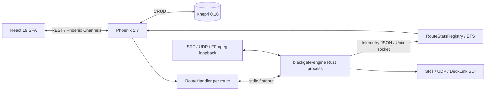

# Blackgate Technical Architecture

Document version: 3.0  
Platform baseline: Ubuntu 24.04 LTS  
Runtime status: Rust-only media engine

## System architecture

Elixir/OTP owns control plane, supervision, persistence, API, and telemetry
fan-out. One Rust process owns each active media route. `RouteHandler` starts
engine through Erlang Port, writes control commands to stdin, consumes lifecycle
events from stdout, and supervises stalls/reconnects. Engine reports structured
statistics through `/tmp/hydra_unix_sock`.

RTMP, HLS, and HTTP-FLV inputs retain FFmpeg loopback sidecar: FFmpeg remuxes to
MPEG-TS over local SRT, then Rust/GStreamer consumes normalized stream.

## Technology contract

| Layer | Required technology |
| --- | --- |
| OS | Ubuntu 24.04 LTS amd64 |
| Backend | Elixir 1.18.2, Erlang/OTP 27.0.1, Phoenix 1.7 |
| Persistence | Khepri 0.16 only; no Ecto/SQL runtime |
| Media | Rust 1.96.0, GStreamer 1.24, SRT 1.5 |
| Frontend | React 19, Vite 6, Ant Design 5, Node 20.19.0 |
| Appliance | Bare-metal OTP release with bundled ERTS, systemd |

Canonical pins live in `.tool-versions`, `rust-toolchain.toml`, `Dockerfile`,
and Ubuntu ISO workflow. `scripts/check_toolchain_contract.sh` prevents drift.

## Production assembly

`mix release` invokes `native/Makefile`, copies only
`blackgate-engine` into application `priv/native/build`, builds React assets,
and includes ERTS. Runtime container and ISO use Ubuntu 24.04. Installed ISO
appliance runs release directly through systemd; Docker is unnecessary on
gateway.

Rust-only guard scans production build/runtime paths and release contents.
Archived oracle sources, test spikes, and SDK headers cannot become runtime
dependencies.

## Persistence

Khepri stores route maps and nested destination maps. Test runtime uses isolated
temporary Khepri directory. Backups use Khepri-native database data plus route
export APIs. Removed Ecto modules/migrations are not supported compatibility
paths.

## Migration evidence

Historical C engine is frozen, checksummed benchmark oracle under
`native/archive/c-engine/`. It is built only in Ubuntu 24.04 benchmark image.
Harness runs equivalent non-SDI workloads against oracle and Rust engine,
collects throughput, loss, CPU, RSS, lifecycle, and failover data, then applies
thresholds from `benchmarks/migration/thresholds.json`.

See:

- `docs/migration/RUST_MIGRATION_STATUS.md`
- `benchmarks/migration/README.md`
- `docs/migration/SDI_MANUAL_SIGNOFF.md`

## Completion boundary

Automated completion requires all functional, release, Ubuntu image, and
performance gates. Physical DeckLink video/audio, mode detection, recovery,
failover, and one-hour stability require operator sign-off. Repository must
remain `SDI_MANUAL_PENDING` until that checklist passes; only then may status
become `PRODUCTION_COMPLETE`.
