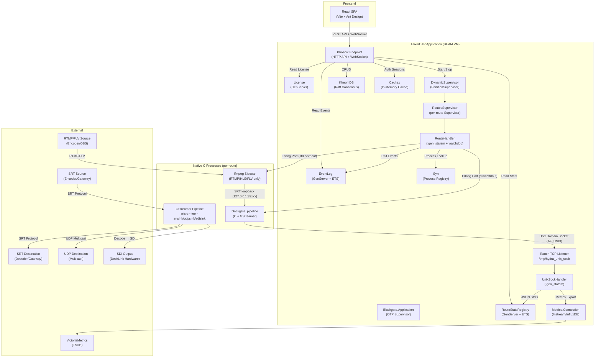

# Blackgate — Software Design Review: Technical Analysis

> **Document Version**: 2.0
> **Date**: 2026-05-24
> **Source Codebase**: `visual-alchemy/blackgate-project` (blackgate v0.3.0)
> **Analysis Method**: Static code analysis of all source files, updated for SDI output, RTMP/ffmpeg sidecar, event log, watchdog, and connection monitoring

---

## Table of Contents

1. [Architecture & Tech Stack](#1-architecture--tech-stack)
2. [Core Functionality](#2-core-functionality)
3. [Architectural Improvements](#3-architectural-improvements-vs-legacy)
4. [Deployment & Infrastructure](#4-deployment--infrastructure)
5. [Issues & Roadmap](#5-issues--roadmap)

---

## 1. Architecture & Tech Stack

### 1.1 System Architecture Overview



### 1.2 Backend: Elixir + Phoenix

**✅ CONFIRMED** — The backend is built on **Elixir 1.18 / OTP 27** with **Phoenix 1.7.14**.

**Evidence from `mix.exs`:**
```elixir
{:phoenix, "~> 1.7.14"},
{:plug_cowboy, "~> 2.7"},
```
**Note:** Ecto/SQLite3 dependencies exist in `mix.exs` (`phoenix_ecto`, `ecto_sqlite3`) but are vestigial — production data is stored exclusively in Khepri.

#### Concurrency Model

Blackgate uses advanced OTP concurrency patterns, **not** basic GenServer:

| Pattern | Module | Purpose |
|---------|--------|---------|
| **`:gen_statem`** (State Machine) | `RouteHandler` | Manages lifecycle of each C pipeline process with state transitions (`start` → `started` → `reconnecting`). Includes 60s watchdog for stalled pipeline detection. |
| **`:gen_statem`** (State Machine) | `UnixSockHandler` | Handles bidirectional communication over Unix socket with state (`exchange`) |
| **`GenServer`** | `RouteStatsRegistry` | Owns the ETS table for real-time stats storage |
| **`GenServer`** | `EventLog` | In-memory ring buffer (ETS, 500 events) for route lifecycle events |
| **`GenServer`** | `License` | License validation, trial mode, RSA key verification, heartbeat re-verification |
| **`GenServer`** | `ErlSysMon` | Monitors BEAM VM health (GC pauses, scheduling delays, busy ports) |
| **`PartitionSupervisor`** | `Blackgate.DynamicSupervisor` | Distributes route processes across all scheduler threads to avoid bottlenecks |
| **`DynamicSupervisor`** | (child of PartitionSupervisor) | Dynamically starts/stops per-route supervisors |
| **`Supervisor`** | `RoutesSupervisor` | Per-route supervisor wrapping the `RouteHandler` — `one_for_all` strategy, `max_restarts: 10` in 60s |
| **`Registry`** (partitioned) | `Blackgate.Registry.MsgHandlers` | Partitioned process registry for message handlers |
| **Syn** | Process registration | Distributed process registry for route lookup (`:syn.lookup(:routes, id)`) |
| **Ranch** | TCP listener | High-performance connection acceptor for Unix Domain Socket (up to 75,000 connections, 100 acceptors) |

**Key Design Decision**: The use of `:gen_statem` over `GenServer` for `RouteHandler` is significant — it provides a proper finite state machine for managing pipeline lifecycle, including clean state transitions and trapped exits for graceful shutdown.

**Supervision Tree:**
```
Blackgate.Supervisor (one_for_one)
├── Cachex (auth session cache)
├── RouteStatsRegistry (ETS owner)
├── EventLog (ETS ring buffer, 500 events)
├── License (trial mode + RSA validation GenServer)
├── ErlSysMon (VM health monitor)
├── PartitionSupervisor
│   └── DynamicSupervisor (per-partition)
│       └── RoutesSupervisor (per-route, registered via Syn)
│           └── RouteHandler (:gen_statem + watchdog, transient restart)
├── Registry (MsgHandlers, partitioned)
├── Telemetry
├── Phoenix.PubSub (partitioned)
├── Phoenix.Endpoint
└── Metrics.Connection (Instream/InfluxDB)
```

### 1.3 Streaming Engine: C + GStreamer + ffmpeg Sidecar

**✅ CONFIRMED** — The native streaming engine is implemented in **C** using **GStreamer 1.0** and compiled to a standalone binary (`blackgate_pipeline`). For RTMP/HLS/HTTP-FLV sources, an **ffmpeg sidecar** process normalizes the stream to SRT before entering the GStreamer pipeline.

**Source Files:**

| File | Lines | Purpose |
|------|-------|---------|
| `native/src/gst_pipeline.c` | 1,591 | Core pipeline: SRT stats collection, MPEG-TS parsing (PAT/PMT/PES), H.264/HEVC/MPEG-2 video info extraction, SDI output via decodebin, pipeline construction |
| `native/src/main.c` | 104 | Entry point: reads route_id from argv, JSON config from stdin, initializes GStreamer and Unix socket |
| `native/src/unix_socket.c` | 47 | Unix Domain Socket client: connects to `/tmp/hydra_unix_sock`, sends stats and metadata |

#### IPC Mechanism: Dual-Channel Communication

**✅ CONFIRMED** — Communication between Elixir and C uses **two separate channels**:

**Channel 1: Erlang Port (stdin/stdout) — Command Channel**
```
Elixir RouteHandler → [stdin] → C main() → JSON config parsed
C pipeline logs     → [stdout] → Elixir RouteHandler (logged)
```
- Used for: Sending initial pipeline configuration (source + sinks JSON)
- Direction: Primarily Elixir → C (one-time command), C → Elixir (log output)

**Channel 2: Unix Domain Socket — Stats Channel**
```
C pipeline → [AF_UNIX, /tmp/hydra_unix_sock] → Ranch → UnixSockHandler
```
- Used for: Continuous real-time stats streaming (every 1 second)
- Protocol: `AF_UNIX`, `SOCK_STREAM` (TCP over UDS)
- Server: Ranch TCP listener (Elixir side, started in `application.ex`)
- Client: C process connects on startup (`init_unix_socket()`)
- Messages: Newline-delimited JSON with prefixes (`route_id:`, `stats_sink:`, `stats_source_stream_id:`)

**Why Dual Channels?** The Port (stdio) channel provides Erlang's built-in process linking — when the C process crashes, the Port closes and the `RouteHandler` receives an exit signal, enabling automatic cleanup. The Unix socket provides a high-throughput data channel that doesn't block the Port's control path.

### 1.4 Database: Khepri (Raft-based)

**✅ CONFIRMED** — Blackgate uses **Khepri 0.16.0** as its primary persistent storage. **No traditional SQL database is used** in production (Ecto/SQLite3 deps exist but are commented out).

**Evidence from `mix.exs`:**
```elixir
{:khepri, "0.16.0"},
```

**Evidence from `application.ex`:**
```elixir
khepri_data_dir = System.get_env("DATABASE_DATA_DIR", "#{File.cwd!()}/khepri##{node()}")
:khepri.start(khepri_data_dir)
```

**Data Model (from `db.ex`):**

Khepri stores data in a tree structure with path-based addressing:

```
routes/
├── {route_id_1}/
│   ├── (route data: name, schema, schema_options, status, exportStats, etc.)
│   └── destinations/
│       ├── {dest_id_1}/ (destination data)
│       └── {dest_id_2}/ (destination data)
└── {route_id_2}/
    └── ...
```

**Operations verified in `db.ex`:**
- `create_route` → `:khepri.put(["routes", id], data)`
- `get_route` → `:khepri.get!(["routes", id])`
- `get_all_routes` → `:khepri.get_many("routes/*")`
- `update_route` → `:khepri.transaction()` with `:khepri_tx.get/put` (atomic read-modify-write)
- `delete_route` → `:khepri.delete(["routes", id])` + `:khepri.delete_many("routes/#{id}/destinations/*")`
- `backup` → `:khepri.get_many("**")` serialized with `:erlang.term_to_binary`
- `restore_backup` → `:khepri.delete_many("**")` then re-insert all

**Khepri Advantages:**
- Built on Ra (Raft consensus) — enables future multi-node clustering
- No external database dependency
- Data directory mounted as Docker volume (`./data/khepri:/app/khepri`)
- Embedded in the BEAM VM — zero network overhead for DB operations

### 1.5 Stats Storage: ETS (Erlang Term Storage)

**✅ CONFIRMED** — Real-time statistics are stored in **ETS** via the `RouteStatsRegistry` GenServer.

**Evidence from `route_stats_registry.ex`:**
```elixir
:ets.new(@table_name, [:named_table, :public, :set, read_concurrency: true])
```

**Key Properties:**
- `:named_table` — Accessed by atom `:route_stats` globally
- `:public` — Any process can read/write (no GenServer bottleneck for reads)
- `:set` — Key-value storage with unique keys
- `read_concurrency: true` — Optimized for concurrent reads (many API requests reading stats simultaneously)

**Data Layout:**

| Key Format | Value | Use |
|-----------|-------|-----|
| `route_id` (string) | `{route_id, stats_map, timestamp_ms}` | Source stats per route |
| `{route_id, :sink, sink_index}` (tuple) | `{key, stats_map, timestamp_ms}` | Per-sink/destination stats |

**Performance Characteristics:**
- Write: O(1) per stats update (every 1s per pipeline from `UnixSockHandler`)
- Read: O(1) per route lookup (from `RouteController.stats/2`)
- No serialization bottleneck — direct ETS access from API handlers
- Stats are ephemeral — lost on restart (appropriate for real-time data)

---

## 2. Core Functionality

### 2.1 Routing Logic: SRT Modes

The system supports all three SRT connection modes. The mode configuration flows through:

**API → Khepri DB → RouteHandler → C Pipeline → GStreamer**

**Modes are set via the SRT URI** (not as separate GStreamer properties):

```
srt://{localaddress}:{localport}?mode={listener|caller|rendezvous}&passphrase=...&pbkeylen=...
```

**From `route_handler.ex` → `build_srt_uri/1`:**
```elixir
query_params = %{}
  |> maybe_add_param(opts, "mode")        # listener, caller, or rendezvous
  |> maybe_add_param(opts, "passphrase")  # SRT encryption passphrase
  |> maybe_add_param(opts, "pbkeylen")    # Key length (16, 24, 32)
  |> maybe_add_param(opts, "poll-timeout")
```

**From `gst_pipeline.c` → `set_srt_mode_property/3`:**
```c
// GStreamer SRT mode values: 0=none, 1=caller, 2=listener, 3=rendezvous
if (strcmp(mode_str, "listener") == 0)    mode_value = 2;
else if (strcmp(mode_str, "caller") == 0) mode_value = 1;
else if (strcmp(mode_str, "rendezvous") == 0) mode_value = 3;
```

**Supported Source/Sink Types:**

| Source Type | Sink Type | Supported Properties |
|-------------|-----------|---------------------|
| `srtsrc` | `srtsink` | `uri`, `latency`, `auto-reconnect`, `keep-listening`, `mode`, `passphrase`, `pbkeylen`, `poll-timeout`, `streamid` |
| `udpsrc` | `udpsink` | `address`/`host`, `port`, `buffer-size`, `mtu` |
| `rtmp` / `hls` / `http-flv` (via ffmpeg sidecar → SRT loopback) | `srtsink` / `udpsink` / `sdisink` | Ffmpeg sidecar normalizes to SRT: `url`, `stream_key`, reconnect options |
| — | `sdisink` (DeckLink) | `device_number` (0–7), `video_mode` (1080p25…2160p60), `audio_channels` |

### 2.1b SDI Output Pipeline

SDI output uses a GStreamer decode pipeline parallel to the SRT passthrough tee:

```
srtsrc → tee ─┬─→ queue2 → srtsink/udpsink (passthrough, no decode)
              ├─→ queue2 → tsdemux ─┬─→ decodebin(video) → videoconvert → videorate → videoscale → capsfilter(UYVY) → decklinkvideosink
              │                     └─→ decodebin(audio) → audioconvert → audioresample → decklinkaudiosink
              └─→ thumbnail branch (JPEG preview)
```

**Key design decisions:**
- **`decodebin`** for codec-agnostic decode — handles H.264, HEVC, MPEG-2 video; AAC, MP2, Opus audio
- **`sync=FALSE` on video sink / `sync=TRUE` on audio sink** — video is paced upstream, while audio relies on GStreamer clock-slaving to prevent stuttering
- **Graceful failure**: If SDI sink fails, SRT/UDP outputs continue unaffected
- **SDI port conflict prevention**: UI dropdown disables ports already in use, shows which route uses them

### 2.1c Watchdog (Stalled Pipeline Detection)

**✅ CONFIRMED** — `RouteHandler` includes a 60-second heartbeat watchdog (`2113456`).

The watchdog timer fires every 60 seconds. On each tick, `RouteHandler` checks whether the pipeline has produced any new stats (bytes received) since the last check. If not, the pipeline is considered stalled and the route is automatically restarted. This recovers from GStreamer deadlocks, decoder freezes, and network stalls without manual intervention.

### 2.2 Connection Monitoring & Auto-Reconnect

`RouteHandler` monitors SRT connection status in real time:
- **Connected**: `connected-callers > 0` (listener mode) or `bytes-received > 0` (caller mode)
- **Waiting**: Pipeline is running but no active SRT connection
- **Reconnecting**: Pipeline detected disconnect and is attempting auto-recovery (10s retry, 3-minute timeout)
- **Off**: Route process is stopped

Connection status is exposed via the API, displayed in the UI as a colored badge, and tracked in the Event Log.

### 2.3 ffmpeg Sidecar (RTMP/HLS/HTTP-FLV Sources)

RTMP, HLS, and HTTP-FLV sources are not natively handled by GStreamer. Instead, an ffmpeg sidecar process normalizes them to SRT MPEG-TS via localhost loopback before entering the GStreamer pipeline. See [Section 6: FFmpeg Sidecar Architecture](#6-ffmpeg-sidecar-architecture-rtmphlshttp-flv--sdi) for the detailed architecture.

**Supported protocols:** RTMP push/pull, HLS (.m3u8), HTTP-FLV (.flv)

### 2.4 Authentication

#### Layer 1: API Authentication (Bearer Token)

**From `auth_controller.ex` and `router.ex`:**

1. Login via `POST /api/login` with `{user, password}`
2. Credentials validated against environment variables (`API_AUTH_USERNAME`, `API_AUTH_PASSWORD`)
3. On success: 30-byte cryptographically random token generated (`crypto.strong_rand_bytes/1`)
4. Token stored in **Cachex** with 14-day TTL: `Cachex.put(Blackgate.Cache, "auth_session:#{token}", user, ttl: :timer.hours(24 * 14))`
5. Subsequent API requests require `Authorization: Bearer {token}` header
6. Token validated via `Cachex.get(Blackgate.Cache, "auth_session:#{token}")`

> ⚠️ **Note**: The code contains `TODO: Implement a proper authentication mechanism`. Current auth compares against plain-text env vars.

#### Layer 2: SRT Stream Authentication (Passphrase)

- SRT passphrase is passed via the SRT URI query parameter: `?passphrase=xxx&pbkeylen=16`
- This is **not** application-level auth — it's SRT protocol-level AES encryption
- Key lengths supported: 16, 24, or 32 bytes
- The `on_caller_connecting` callback in `gst_pipeline.c` handles incoming SRT connections and automatically authenticates (`*authenticated = TRUE`)

### 2.3 Monitoring Metrics

#### Source Stats (extracted every 1 second from `print_stats` thread in `gst_pipeline.c`):

| Metric | Type | Description |
|--------|------|-------------|
| `total-bytes-received` | uint64 | Cumulative bytes received |
| `packets-received` | int64 | Packets received in interval |
| `packets-received-lost` | int64 | Lost packets |
| `packets-received-dropped` | int64 | Dropped packets |
| `packets-received-retransmitted` | int64 | Retransmitted packets (SRT ARQ) |
| `bytes-received` | int64 | Bytes received in interval |
| `rtt-ms` | double | Round Trip Time in milliseconds |
| `receive-rate-mbps` | double | Current receive rate |
| `bandwidth-mbps` | double | Estimated link bandwidth |
| `negotiated-latency-ms` | int | SRT negotiated latency |
| `connected-callers` | int | Number of connected SRT callers |
| `callers[]` | array | Per-caller detailed stats (address, individual metrics) |

#### Video Metadata (from MPEG-TS PAT/PMT/PES parsing):

| Metric | Type | Description |
|--------|------|-------------|
| `video-width` | int | Horizontal resolution |
| `video-height` | int | Vertical resolution |
| `video-framerate-num` | int | Framerate numerator |
| `video-framerate-den` | int | Framerate denominator |
| `video-framerate-inferred` | bool | Whether framerate is estimated vs. detected |
| `video-interlace-mode` | string | `"progressive"` or `"interleaved"` |

#### Sink/Destination Stats (from `print_sink_stats` thread):

Similar SRT metrics reported per-sink, including connection and transmission statistics.

#### Metrics Export Pipeline:

```
C Pipeline → Unix Socket → UnixSockHandler → stats_to_metrics() → Metrics.Connection → VictoriaMetrics/InfluxDB
```

Uses the **Instream** library with InfluxDB v2 protocol. Configurable via `VICTORIOMETRICS_HOST` and `VICTORIOMETRICS_PORT` environment variables.

### 2.5 Event Log System

**✅ CONFIRMED** — `Blackgate.EventLog` is a GenServer with an ETS-based ring buffer (max 500 events).

Events are emitted from `RouteHandler` (route started, stopped, crashed, reconnecting, SDI failed) and stored with:
- `id` (integer), `timestamp` (ISO8601), `severity` (`:info`, `:warning`, `:critical`)
- `type` (atom: `:route_started`, `:route_stopped`, `:route_crashed`, `:sdi_failed`, `:reconnecting`, etc.)
- `route_id`, `message` (human-readable), `details` (map)

**API endpoints:** `GET /api/events` (filterable by severity, route_id, type), `GET /api/events/counts`, `DELETE /api/events`

**Future:** PubSub broadcast for real-time event push to frontend via WebSocket (planned).

### 2.6 License Management

**✅ CONFIRMED** — `Blackgate.License` GenServer manages licensing with:
- **Trial mode**: 30-day trial, max 2 routes
- **RSA-encrypted license keys**: Validated against a license server over HTTP
- **Offline resilience**: License cached in Khepri, re-verified via heartbeat every 6 hours
- **Machine ID**: Hardware-based identifier (MAC + SHA-256) for license locking

---

## 3. Architectural Improvements vs. Legacy

### 3.1 Native Process vs. Docker Container/FFmpeg

| Aspect | Legacy (Docker + FFmpeg) | Blackgate (Native C + GStreamer) |
|--------|--------------------------|----------------------------------|
| **Startup Time** | 2-10s (container init + FFmpeg launch) | <100ms (fork + exec of native binary) |
| **Memory Overhead** | ~50-100 MB per container (OS layers, filesystem) | ~15-30 MB per pipeline (GStreamer + SRT only) |
| **CPU Overhead** | Container runtime (cgroups, namespaces) + FFmpeg transcoding | Direct GStreamer pipeline, zero container overhead |
| **IPC** | Docker networking (veth pairs, NAT) | Unix Domain Socket (kernel-level, zero-copy potential) |
| **Process Management** | Docker daemon dependency, API calls to start/stop | Erlang Port supervision, automatic crash recovery |
| **Scaling** | Limited by Docker daemon (~1000 containers) | Limited by file descriptors (65,536+ configurable) |
| **Protocol Support** | FFmpeg command-line complexity | Native GStreamer SRT/UDP elements, direct API access |
| **Stats Collection** | External monitoring required | In-process stats via GStreamer API + inline MPEG-TS parsing |
| **Crash Isolation** | Container crash = restart entire container | C process crash = Erlang Port closes → RouteHandler terminates → Supervisor restarts only that route |

### 3.2 Key Architectural Advantages

**1. Process-per-Route with OTP Supervision**
```
PartitionSupervisor → DynamicSupervisor → RoutesSupervisor → RouteHandler → C Pipeline
```
Each route is supervised individually. A crash in one pipeline cannot affect any other route or the main application. The `RoutesSupervisor` allows up to 10 restarts in 60 seconds before giving up, providing automatic recovery for transient failures.

**2. Zero-Overhead Transport (No Transcoding)**  
GStreamer pipelines use `tsparse` for MPEG-TS remuxing — the video/audio streams are **not transcoded**. This provides a pure transport layer with minimal CPU usage per stream, unlike FFmpeg which often defaults to transcoding.

**3. Shared BEAM VM Resources**  
All route management, stats collection, API handling, and database operations run in a single BEAM VM. This eliminates inter-container communication overhead and enables:
- Shared ETS stats table (sub-microsecond reads)
- Shared Khepri database (no network round-trips)
- Shared metrics export connection pool
- Shared authentication cache

**4. Native SRT Library Integration**  
The C pipeline links directly against `libsrt`, avoiding FFmpeg's SRT wrapper overhead. This provides access to the full SRT API including caller management, per-caller stats, and fine-grained connection control (`on_caller_connecting` callback).

---

## 4. Deployment & Infrastructure

### 4.1 Dockerfile Analysis

**Multi-stage build** (2 stages):

#### Stage 1: Builder (`hexpm/elixir:1.18.2-erlang-27.0.1-debian-bookworm`)
```
1. Install build tools (gcc, make, git, curl)
2. Install Node.js 18.x
3. Install GStreamer dev libraries + libsrt + libcjson + cmocka
4. Install Elixir deps (mix deps.get, mix deps.compile)
5. Build C native binary (make -C native clean && make)
6. Build React frontend (npm install, npm run build)
7. Compile Elixir (mix compile)
8. Create release (mix release --overwrite)
   └── Custom release steps: copy_c_app/1, copy_web_app/1
```

#### Stage 2: Runner (`debian:bookworm-slim`)
```
1. Install runtime-only dependencies (no dev headers)
2. Install runtime GStreamer plugins + libsrt + libcjson
3. Copy release from builder
4. Entrypoint: tini → run.sh → bin/server
```

**Key Differences: Development vs. Production**

| Aspect | Development (`make dev`) | Production (Docker/Release) |
|--------|--------------------------|----------------------------|
| C binary path | `./native/build/blackgate_pipeline` | `#{:code.priv_dir(:blackgate)}/native/build/blackgate_pipeline` |
| Frontend | Vite dev server (`:5173`) | Pre-built static files in `priv/static/` |
| Backend | `iex -S mix phx.server` (interactive shell) | OTP release binary (`bin/server`) |
| Database | Local Khepri in `./khepri#node()` | Mounted volume `/app/khepri` |
| Hot reload | Yes (Elixir code reloading) | No (compiled release) |
| Observer | Available (`:wx, :observer` deps) | Not included |
| Environment | `MIX_ENV=dev` | `MIX_ENV=prod` |

### 4.2 Docker Compose Configuration

```yaml
network_mode: host  # Direct host networking (no Docker NAT)
volumes:
  - ./data/khepri:/app/khepri    # Persistent database
  - ./data/backup:/app/backup    # Backup storage
```

**Host networking** is critical — SRT requires direct port binding for listener mode (each route binds its own port). Docker's NAT would add latency and complicate SRT's connection management.

### 4.3 System-Level Dependencies

#### Build-Time Dependencies
| Library | Package (Debian) | Purpose |
|---------|------------------|---------|
| GStreamer 1.0 | `libgstreamer1.0-dev`, `libgstreamer-plugins-base1.0-dev` | Media pipeline framework |
| GStreamer Plugins Good | `gstreamer1.0-plugins-good` | Standard codecs (mpegts, rtp, udp) |
| GStreamer Plugins Bad | `gstreamer1.0-plugins-bad` | SRT source/sink elements |
| libsrt | `libsrt-openssl-dev` | SRT protocol library |
| libcjson | `libcjson-dev` | JSON parsing in C |
| cmocka | `libcmocka-dev` | C unit testing framework |
| GLib 2.0 | `libglib2.0-dev` | GObject type system (for GStreamer) |
| pkg-config | `pkg-config` | Build configuration tool |
| GCC | `build-essential` | C compiler |
| Node.js 18 | `nodejs` | Frontend build toolchain |

#### Runtime Dependencies
| Library | Package (Debian) | Purpose |
|---------|------------------|---------|
| GStreamer 1.0 | `libgstreamer1.0-0`, `libgstreamer-plugins-base1.0-0` | Pipeline runtime |
| GStreamer Plugins Good | `gstreamer1.0-plugins-good` | Codec plugins |
| GStreamer Plugins Bad | `gstreamer1.0-plugins-bad` | SRT elements |
| libsrt | `libsrt1.5-openssl` | SRT runtime |
| libcjson | `libcjson1` | JSON runtime |
| tini | `tini` | PID 1 init process for Docker (handles SIGTERM properly) |
| iptables | `iptables` | Network configuration |
| OpenSSL | `openssl` | TLS/crypto support |

---

## 5. Issues & Roadmap

### 5.1 TODO / FIXME Comments Found in Code

| File | Line | Comment | Severity |
|------|------|---------|----------|
| `router.ex` | 60 | `# TODO: improve this` — Refers to the backup restore endpoint (`/api/restore`) using `api_no_parse` pipeline | Low |
| `auth_controller.ex` | 5 | `# TODO: Implement a proper authentication mechanism` — Current auth compares against plain-text environment variables | **High** |

### 5.2 Incomplete / Planned Features

Based on code analysis:

| Feature | Status | Evidence |
|---------|--------|----------|
| **Cluster Mode** | 🟡 Partially Prepared | Khepri (Raft-based) supports multi-node. Syn configured for `:routes` scope. `node_controller.ex` exists for node management. **But**: no actual clustering logic implemented yet. |
| **RTMP Input** | ✅ Implemented (v0.3.0) | RTMP, HLS, and HTTP-FLV sources via ffmpeg sidecar → SRT loopback. Cross-protocol routing to SRT/UDP/SDI. |
| **SDI Output** | ✅ Implemented (v0.3.0) | Blackmagic DeckLink output via codec-agnostic decodebin pipeline. 12 video modes from 480i SD to 2160p60 4K. |
| **Event Log** | ✅ Implemented (v0.3.0) | In-memory ring buffer (ETS, 500 events). Route lifecycle, SDI failures, reconnects. API + UI page. |
| **Watchdog** | ✅ Implemented (v0.3.0) | 60-second heartbeat to detect stalled pipelines, auto-restart. |
| **ffmpeg Auto-Reconnect** | ✅ Implemented (v0.3.0) | Auto-reconnect for RTMP/HLS/HTTP-FLV sources (10s retry, 3min timeout). |
| **Credential Management** | ✅ Implemented (v0.2.0) | Settings UI allows changing admin username/password, persisted in Khepri. |
| **Bulk Operations** | ✅ Implemented (v0.2.0) | Bulk start/stop + bulk delete via table checkboxes. |
| **Route Cloning** | ✅ Implemented (v0.2.0) | Clone routes with all destinations via button. |
| **Search & Filter** | ✅ Implemented (v0.2.0) | Filter by name, status, schema. Persisted across navigation. |
| **WebSocket Live Stats** | ✅ Implemented (v0.2.0) | Phoenix Channels push real-time stats; HTTP polling as fallback. |
| **StreamID Support** | ✅ Implemented (Unreleased) | Optional Stream ID field for SRT Caller sources/destinations (`391b189`). |
| **HLS Output** | 🔴 Not Implemented | No HLS sink type. Only `srtsink`, `udpsink`, and `sdisink` exist. HLS relay via MediaMTX planned. |
| **Ecto/SQL Database** | 🟡 Vestigial | `api.ex` contains full Ecto CRUD operations but `Blackgate.Repo` is commented out in the supervision tree. |
| **Proper Authentication** | 🟡 Basic Implementation | Auth uses env-var credentials with Cachex session tokens, plus credential management UI. No JWT, no role-based access. |
| **Metrics Dashboard** | 🟡 Infrastructure Ready | VictoriaMetrics/InfluxDB integration exists (`Instream`), Grafana provisioning directory exists. |
| **DNS Cluster Discovery** | 🔴 Commented Out | `dns_cluster_query` config line exists but is commented out in `runtime.exs`. |
| **Hardware Decode (VA-API/NVDEC)** | 🔴 Not Implemented | VA-API tested but disabled — Intel HD 630 too weak for real-time decode. NVDEC not yet tested. |

### 5.3 Identified Risks

#### Risk 1: C Pipeline Crash Handling

**Question**: Does a C pipeline crash affect the main Elixir backend?

**Answer: No** — The architecture provides strong crash isolation:

```
C process crashes
  → Erlang Port closes
    → RouteHandler receives {:EXIT, port, reason}
      → RouteHandler.terminate/3 called (sets route status to "stopped", kills OS process)
        → RoutesSupervisor detects child termination
          → Automatic restart (up to 10 times in 60 seconds, transient strategy)
```

**Evidence from `route_handler.ex`:**
```elixir
Process.flag(:trap_exit, true)  # Traps exit signals from the C port

def terminate(reason, _state, %{port: port, id: id}) when is_port(port) do
  close_port(port)              # Graceful cleanup
  Blackgate.set_route_status(id, "stopped")
end
```

**Risk mitigation**: The `RoutesSupervisor` uses `restart: :transient` — it only restarts on abnormal termination. The `close_port` function attempts both `Port.close/1` and `kill -9` for reliability.

#### Risk 2: Unix Socket Saturation

- Ranch is configured for **75,000 max connections** with **100 acceptors**
- Each running route creates one Unix socket connection
- Risk is low for typical deployments (hundreds of routes) but could be tested for extreme scale
- Each `UnixSockHandler` sets `max_heap_size: 90 MB` to prevent memory runaway

#### Risk 3: Stats Message Parsing

- The `split_stats_message` function handles concatenated source + sink stats in a single TCP message
- Edge case: if JSON messages are split across TCP segments, parsing may fail
- Mitigation: Ranch TCP socket is configured with `active: true` mode and messages are newline-delimited

#### Risk 4: Memory Management

- **Positive**: `ErlSysMon` monitors for long GC pauses (>250ms), long schedules (>100ms), busy ports
- **Positive**: Per-process heap limits (`max_heap_size: 90 MB` on socket handlers)
- **Risk**: ETS table for stats grows linearly with running routes (mitigated by ephemeral nature)

#### Risk 5: Commented-Out Ecto/SQLite Code

- `api.ex` contains full Ecto CRUD operations that are unused
- `Blackgate.Repo` is commented out in the supervision tree
- `ecto_sqlite3` dependency is still included in `mix.exs`
- **Risk**: Dead code may cause confusion; dependency adds to build size

#### Risk 6: ffmpeg Sidecar Crash Handling

- ffmpeg sidecar processes for RTMP/HLS/HTTP-FLV sources are spawned via Erlang Port
- If ffmpeg crashes, the Port closes → RouteHandler detects exit → auto-reconnect logic triggers
- If the source URL becomes permanently unavailable, the route may repeatedly restart (mitigated by 10 restart/60s supervisor limit)
- **Mitigation**: Watchdog detects stalled pipelines even after ffmpeg restart

---

## Appendix A: File Inventory

### Backend (Elixir)

| File | Lines | Role |
|------|-------|------|
| `lib/blackgate/application.ex` | 82 | OTP Application (supervision tree, Ranch, Khepri, EventLog, License) |
| `lib/blackgate.ex` | 56 | Public API (start/stop/restart routes) |
| `lib/blackgate/route_handler.ex` | 653 | Pipeline lifecycle (gen_statem + watchdog), ffmpeg sidecar, SRT URI building, SDI output config |
| `lib/blackgate/unix_sock_handler.ex` | 233 | Stats receiver (gen_statem + Ranch protocol) |
| `lib/blackgate/db.ex` | 209 | Khepri CRUD operations |
| `lib/blackgate/route_stats_registry.ex` | 103 | ETS stats storage (GenServer) |
| `lib/blackgate/event_log.ex` | 113 | In-memory event timeline (GenServer + ETS ring buffer, 500 events) |
| `lib/blackgate/license.ex` | 327 | License management (trial mode, RSA validation, heartbeat) |
| `lib/blackgate/route_health.ex` | 63 | Health evaluation from stats (healthy/warning/critical/disconnected) |
| `lib/blackgate/process_monitor.ex` | 246 | OS-level process stats for C pipelines |
| `lib/blackgate/monitoring/os_mon.ex` | — | OS monitoring (RAM%, CPU%, load averages, swap) |
| `lib/blackgate/machine_id.ex` | — | Hardware-based machine identifier (MAC + SHA-256) |
| `lib/blackgate/release.ex` | — | Release tasks (DB migrations) |
| `lib/blackgate/signal_handler.ex` | — | OS signal handler (SIGTERM) |
| `lib/blackgate/routes_supervisor.ex` | 39 | Per-route supervisor |
| `lib/blackgate/helpers.ex` | 21 | Utility functions (heap limits, kill) |
| `lib/blackgate/erl_sys_mon.ex` | 30 | BEAM VM health monitor |
| `lib/blackgate/metrics.ex` | 21 | Metrics helper |
| `lib/blackgate/metrics/connection.ex` | 4 | Instream/InfluxDB connection |
| `lib/blackgate/api.ex` | 201 | Ecto context (vestigial, unused) |
| `lib/blackgate_web/router.ex` | 106 | API routes and auth middleware |
| `lib/blackgate_web/controllers/` | 14 files | REST API controllers |
| `lib/blackgate_web/channels/stats_channel.ex` | — | WebSocket channel for per-route real-time stats |

### Native (C)

| File | Lines | Role |
|------|-------|------|
| `native/src/gst_pipeline.c` | 1,591 | GStreamer pipeline, SDI decodebin, SRT stats, MPEG-TS parsing |
| `native/src/main.c` | 104 | Entry point, JSON config reader |
| `native/src/unix_socket.c` | 47 | UDS client for stats communication |

### Configuration

| File | Role |
|------|------|
| `config/config.exs` | Compile-time config (Ecto, Logger) |
| `config/runtime.exs` | Runtime config (Phoenix, VictoriaMetrics, auth) |
| `config/dev.exs` | Dev-specific config (debug logging) |
| `config/prod.exs` | Prod-specific config (info logging) |
| `config/test.exs` | Test-specific config |

---

## Appendix B: API Endpoints

| Method | Path | Auth | Controller | Action |
|--------|------|------|-----------|--------|
| `GET` | `/health` | No | `HealthController` | Health check |
| `POST` | `/api/login` | No | `AuthController` | Login, returns token |
| `GET` | `/api/routes` | Yes | `RouteController` | List all routes |
| `POST` | `/api/routes` | Yes | `RouteController` | Create route |
| `POST` | `/api/routes/bulk-action` | Yes | `RouteController` | Bulk start/stop routes |
| `GET` | `/api/routes/:id` | Yes | `RouteController` | Get route details |
| `POST` | `/api/routes/:id/clone` | Yes | `RouteController` | Clone route and its destinations |
| `PUT` | `/api/routes/:id` | Yes | `RouteController` | Update route |
| `DELETE` | `/api/routes/:id` | Yes | `RouteController` | Delete route |
| `GET` | `/api/routes/:id/start` | Yes | `RouteController` | Start pipeline |
| `GET` | `/api/routes/:id/stop` | Yes | `RouteController` | Stop pipeline |
| `GET` | `/api/routes/:id/restart` | Yes | `RouteController` | Restart pipeline |
| `GET` | `/api/routes/:id/stats` | Yes | `RouteController` | Get source stats (ETS) |
| `GET` | `/api/routes/:id/destination-stats` | Yes | `RouteController` | Get sink stats |
| `GET` | `/api/routes/:id/preview` | Yes | `RouteController` | Live JPEG thumbnail |
| `GET/POST/PUT/DELETE` | `/api/routes/:id/destinations/...` | Yes | `DestinationController` | Destination CRUD |
| `GET` | `/api/backup/export` | Yes | `BackupController` | Export Khepri data |
| `GET` | `/api/backup/create-download-link` | Yes | `BackupController` | Create routes download link |
| `GET` | `/api/backup/create-backup-download-link` | Yes | `BackupController` | Create full binary backup link |
| `POST` | `/api/backup/import-routes` | Yes | `BackupController` | Import routes from JSON |
| `POST` | `/api/restore` | Yes | `BackupController` | Restore from full backup |
| `GET` | `/backup/:session_id/download` | Yes | `BackupController` | Download routes file |
| `GET` | `/backup/:session_id/download_backup` | Yes | `BackupController` | Download full backup |
| `GET` | `/api/system/pipelines` | Yes | `SystemController` | List C processes |
| `GET` | `/api/system/pipelines/detailed` | Yes | `SystemController` | Detailed pipeline info |
| `POST` | `/api/system/pipelines/:pid/kill` | Yes | `SystemController` | Kill C process |
| `GET` | `/api/nodes` | Yes | `NodeController` | List cluster nodes |
| `GET` | `/api/nodes/:id` | Yes | `NodeController` | Node details with system stats |
| `GET` | `/api/network/interfaces` | Yes | `NetworkController` | List network interfaces |
| `GET` | `/api/events` | Yes | `EventController` | List events (filter: severity, route_id, type) |
| `GET` | `/api/events/counts` | Yes | `EventController` | Event counts by severity |
| `DELETE` | `/api/events` | Yes | `EventController` | Clear all events |
| `GET` | `/api/license` | Yes | `LicenseController` | Show license status |
| `POST` | `/api/license/activate` | Yes | `LicenseController` | Activate license key |
| `DELETE` | `/api/license/deactivate` | Yes | `LicenseController` | Deactivate license |
| `PUT` | `/api/auth/credentials` | Yes | `AuthController` | Update admin credentials |
| `GET` | `/*path` | No | `PageController` | Serve SPA (React catch-all) |


---

## 6. FFmpeg Sidecar Architecture (RTMP/HLS/HTTP-FLV → SDI)

### 6.1 Overview

RTMP, HLS, and HTTP-FLV sources cannot be directly decoded to SDI output via GStreamer's native elements due to timestamp drift and preroll deadlock issues. The solution uses ffmpeg as a sidecar process to normalize the stream into SRT, which then feeds the proven SRT→SDI pipeline.

```
┌─────────────────────────────────────────────────────────────────────────┐
│ Blackgate Route Process                                                  │
│                                                                          │
│  ┌──────────┐    SRT loopback     ┌──────────────────────────────────┐  │
│  │  ffmpeg   │──────────────────→ │  GStreamer Pipeline               │  │
│  │           │  127.0.0.1:39xxx   │                                    │  │
│  │ RTMP pull │  mode=listener     │  srtsrc(caller) → tee ─┬→ srtsink │  │
│  │ → MPEG-TS │  latency=125ms    │                         ├→ SDI     │  │
│  │ → SRT out │                    │                         └→ thumb   │  │
│  └──────────┘                     └──────────────────────────────────┘  │
│                                                                          │
└─────────────────────────────────────────────────────────────────────────┘
```

### 6.2 Startup Sequence

1. `RouteHandler` detects RTMP/HLS/HTTP-FLV schema
2. `maybe_start_ffmpeg_sidecar()` picks a random port (39000-39999)
3. ffmpeg spawned via Erlang Port: `ffmpeg -i "rtmp://..." -c copy -f mpegts "srt://127.0.0.1:{port}?mode=listener&latency=125"`
4. 3-second sleep to allow ffmpeg to start listening
5. Route config rewritten: `schema: "RTMP"` → `schema: "SRT", mode: "caller", port: {port}`
6. GStreamer pipeline starts with `srtsrc uri="srt://127.0.0.1:{port}?mode=caller"`
7. Pipeline sees a normal SRT source — standard tee → SDI/SRT/thumbnail paths

### 6.3 Why ffmpeg Sidecar Works

| Problem with native GStreamer | How ffmpeg solves it |
|-------------------------------|---------------------|
| `flvdemux` + compressed tee causes timestamp drift after 10-20 min | ffmpeg remuxes to MPEG-TS with normalized PTS/DTS timestamps |
| `rtmpsrc` is a live source — DeckLink preroll deadlocks | SRT loopback is not live — normal preroll works |
| `identity sync=true` drifts for audio after several minutes | SRT protocol adds latency buffer, smoothing timing |
| Standard tee path (mpegtsmux → tsdemux) freezes video for RTMP | ffmpeg's mpegtsmux is battle-tested, produces clean MPEG-TS |

### 6.4 ffmpeg Command

```bash
ffmpeg -hide_banner -loglevel warning \
  [-reconnect 1 -reconnect_streamed 1 -reconnect_delay_max 5]  # HTTP sources only
  -i "{source_url}" \
  -c copy -f mpegts \
  "srt://127.0.0.1:{port}?mode=listener&latency=125"
```

- `-c copy`: No re-encoding (zero CPU for transcode)
- `-f mpegts`: Remuxes into MPEG-TS container (compatible with GStreamer's tsdemux)
- `mode=listener`: ffmpeg listens, GStreamer calls in
- `latency=125`: 125ms SRT latency buffer

### 6.5 SDI Pipeline Configuration (Proven Stable)

```
srtsrc(caller) → tee → queue(5s, non-leaky) → tsdemux → decodebin → queue(5s, non-leaky)
  → videoconvert → videorate(skip-to-first=true) → videoscale → caps(UYVY) → identity(sync=true) → decklinkvideosink(sync=false)
  → audioconvert → audioresample → audiorate → decklinkaudiosink(sync=true)
```

Critical settings that make it work:
- **`sync=false` on video / `sync=true` on audio**: Video timing is paced by an upstream `identity sync=true` element to prevent state change failures, while `decklinkaudiosink` relies on GStreamer's master-clock slaving to align samples dynamically and prevent stuttering.
- **`skip-to-first=true`** on videorate: prevents initial frame burst from overwhelming DeckLink
- **Non-leaky 5-second queues**: absorbs timing variations without dropping frames
- **`audiorate`**: prevents sample rate drift in the audio path

### 6.6 Lifecycle Management

- **Start**: Spawn ffmpeg → wait 3s → start GStreamer pipeline
- **Stop**: Kill GStreamer pipeline (Port.close) → kill ffmpeg (sys_kill by OS PID)
- **ffmpeg crash**: Erlang Port detects `:exit_status` → route process crashes → can be restarted via UI
- **GStreamer crash**: Bus error callback → route stops → logged in Event Log

### 6.7 Supported Source Protocols

| Protocol | ffmpeg input | Example URL |
|----------|-------------|-------------|
| RTMP | `rtmpsrc` → ffmpeg | `rtmp://server:1935/live/key` |
| HLS (.m3u8) | `souphttpsrc` → ffmpeg | `https://server/stream/playlist.m3u8` |
| HTTP-FLV | `souphttpsrc` → ffmpeg | `http://server:8085/stream.flv` |

All protocols are normalized to SRT MPEG-TS before entering the GStreamer pipeline.
