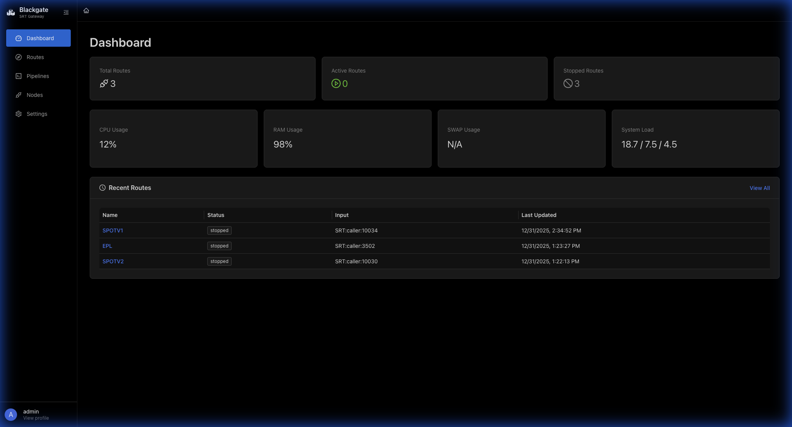
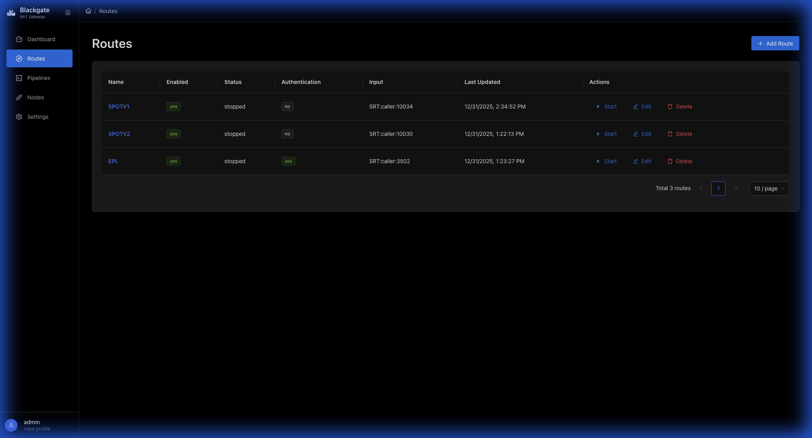
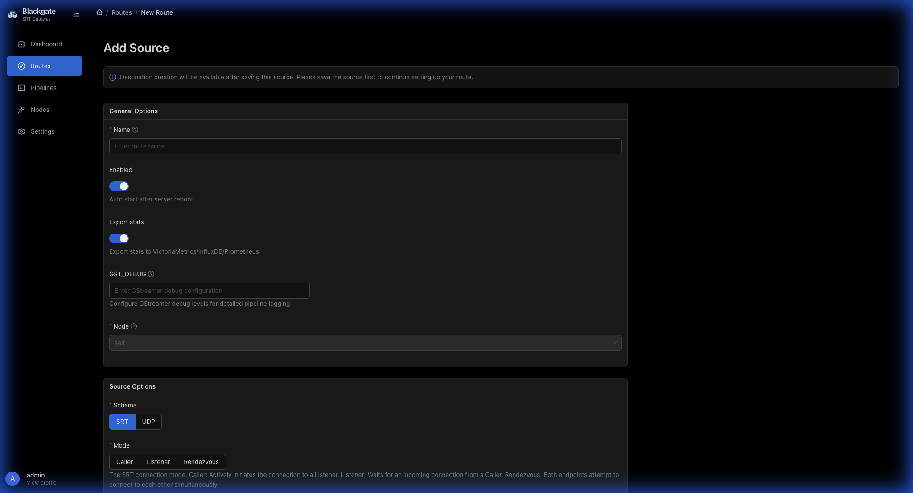
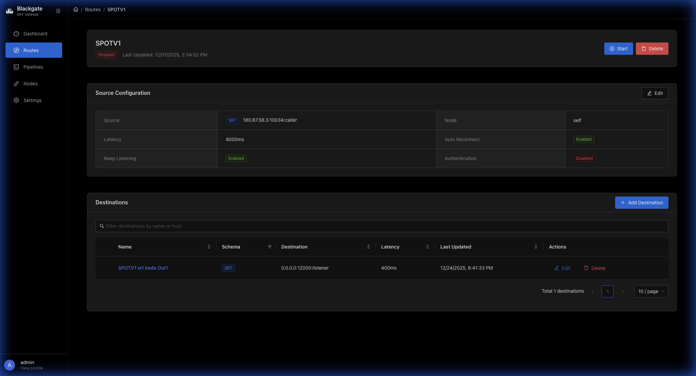

# Blackgate User Guide

This guide will help you get started with Blackgate SRT Gateway. Follow these steps to manage your SRT video streams.

---

## 📖 Table of Contents

1. [Logging In](#logging-in)
2. [Dashboard Overview](#dashboard-overview)
3. [Managing Routes](#managing-routes)
4. [Creating a New Route](#creating-a-new-route)
5. [Route Details & Destinations](#route-details--destinations)
6. [Starting and Stopping Routes](#starting-and-stopping-routes)
7. [Understanding SRT Modes](#understanding-srt-modes)

---

## Logging In

When you first access Blackgate, you'll see the login screen.

**Steps:**
1. Enter your **Username** (default: `admin`)
2. Enter your **Password** (default: `password123`)
3. Optionally check **Remember me** to stay logged in
4. Click **Sign In**

> 💡 **Tip:** Contact your administrator if you don't have login credentials.

---

## Dashboard Overview

After logging in, you'll see the main dashboard with system status and recent activity.

**What you'll see:**

| Section | Description |
|---------|-------------|
| **Route Statistics** | Total number of routes, active routes, and stopped routes |
| **CPU Usage** | Current processor utilization |
| **RAM Usage** | Memory consumption |
| **System Load** | Overall system load average |
| **Recent Activity** | Last modified routes with their status |

**Navigation Menu (Left Sidebar):**
- 🏠 **Dashboard** - System overview
- 🛣️ **Routes** - Manage SRT stream routes
- ⚙️ **Settings** - Application configuration

---

## Managing Routes

Click **Routes** in the sidebar to view all your configured stream routes.

**Route List Columns:**

| Column | Description |
|--------|-------------|
| **Name** | Friendly name for the route |
| **Enabled** | Whether the route is configured to run |
| **Status** | Current state: `running`, `stopped`, or `starting` |
| **Auth** | Authentication status |
| **Input** | Source connection details (e.g., `SRT:caller:10034`) |
| **Last Updated** | When the route was last modified |

**Actions available:**
- ▶️ **Start** - Begin streaming
- ⏹️ **Stop** - Stop the stream
- ✏️ **Edit** - Modify route settings
- 🗑️ **Delete** - Remove the route

---

## Creating a New Route

Click the **+ Add Route** button to create a new SRT stream route.

### Step 1: General Options

| Field | Description |
|-------|-------------|
| **Name** | Give your route a descriptive name |
| **Enabled** | Toggle ON to auto-start on server boot |
| **Export stats** | Enable telemetry for monitoring |
| **Node** | Select which server handles this route |

### Step 2: Source Configuration

| Field | Description |
|-------|-------------|
| **Schema** | Choose `SRT` or `UDP` |
| **Mode** | Select `Caller`, `Listener`, or `Rendezvous` |
| **Local Address** | IP address to bind (for Listener mode) |
| **Local Port** | Port number for the connection |
| **Latency** | Maximum transmission latency (ms) |
| **Auto Reconnect** | Automatically reconnect if disconnected |
| **Keep Listening** | Continue accepting new connections |

### Step 3: Save

Click **Save** to create the route. You can add destinations after the route is created.

---

## Route Details & Destinations

Click on any route name to view its full configuration.

**Page Sections:**

### Header
- Route name and current status
- **Start/Stop** button
- **Delete** button

### Source Section
Shows how the incoming stream is received:
- Connection address and port
- SRT mode (Caller/Listener)
- Latency and other parameters
- Click **Edit** to modify source settings

### Destinations Section
Shows where the stream is being sent:
- List of all output destinations
- Each destination has its own settings
- Click **Add Destination** to add new outputs
- Use **Edit/Delete** icons to manage each destination

---

## Starting and Stopping Routes

### To Start a Route:
1. Go to **Routes** page
2. Find your route in the list
3. Click the **▶️ Start** button
4. Status will change to `running`

### To Stop a Route:
1. Find the running route
2. Click the **⏹️ Stop** button
3. Status will change to `stopped`

> ⚠️ **Important:** Make sure your source encoder/player is properly configured before starting a route.

---

## Understanding SRT Modes

SRT (Secure Reliable Transport) has three connection modes:

### 🔵 Caller Mode
- Blackgate **connects TO** an external SRT listener
- Use when your encoder is in **Listener** mode
- You specify the remote IP and port

### 🟢 Listener Mode
- Blackgate **waits for** incoming connections
- Use when your encoder is in **Caller** mode
- You specify the local port to listen on

### 🟡 Rendezvous Mode
- Both sides try to connect simultaneously
- Useful for NAT traversal
- Both need the same port configured

---

## Quick Reference

| Task | How To |
|------|--------|
| Create new route | Routes → Add Route → Fill form → Save |
| Add destination | Route Details → Add Destination |
| Start streaming | Routes → Start button |
| View statistics | Route Details → Stats shown in cards |
| Edit settings | Route Details → Edit button |

---

## Need Help?

- 📚 Check the [README](../README.md) for technical documentation
- 🐛 Report issues on [GitHub](https://github.com/visual-alchemy/blackgate-project/issues)
- 💬 Contact your system administrator

---

*This guide was created for Blackgate SRT Gateway. For installation and technical setup, see the main README.*
